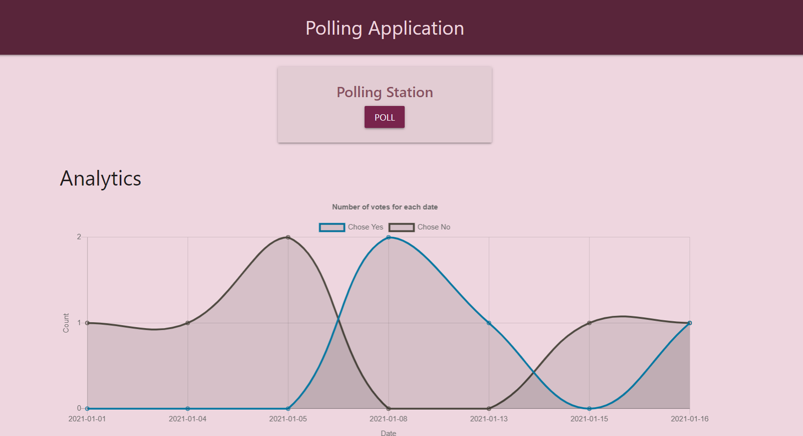

# Polling Application

A simple polling application, where users are given few choices, can vote for one,and check the **trend** of the poll.

## Demo can be found [here](https://polling-app-adi.herokuapp.com/)
---

## Requirements

For development, you will only need Node.js and preferably an IDE.

#### Node can be installed from : [NodeJS](https://nodejs.org/en/)

---

## Libraries/Frameworks Used
1. [ExpressJS](https://expressjs.com/)
    * Express is a Node.js web application framework that provides a robust set of features for web and mobile applications. Routing in this project was done using express.
2. [mongooseJS](https://mongoosejs.com/)
    * MongooseJS a library that helps us with mongoDB operations.
3. [Socjet.IO](https://socket.io/)
    * Socket.IO was used to enable real time communication between the clients and the server. Hence, whenever a client enters a data , it is reflected to all the connected clients.
4. [Express-Handlebars](https://www.npmjs.com/package/express-handlebars)
    * Express-Handlebars is a library that enables us to use handlebars with express-app.
5. [ChartJS](https://www.chartjs.org/)
    * ChartJS was used to display line charts and bar charts in our project.

---

## Installation

#### Run the following command:
        npm install

##   Running the Application
         npm start

_By defualt, the app will run in port 3000: [localhost](http://localhost:3000/)_

---

## Other useful commands

- Run the application in development

        npm run dev
- Run tests

        npm test

    

